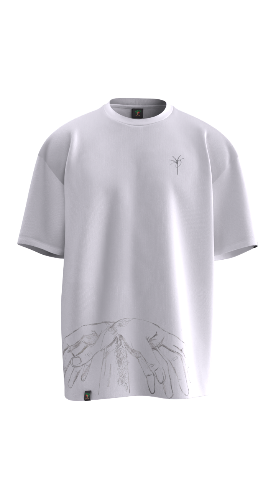

<!-- Preload Inknut Antiqua font -->
<link rel="preload" href="https://fonts.googleapis.com/css2?family=Inknut+Antiqua:wght@300;400;500;600;700&display=swap" as="style">
<link rel="stylesheet" href="https://fonts.googleapis.com/css2?family=Inknut+Antiqua:wght@300;400;500;600;700&display=swap">

<!-- Add Font Awesome CSS -->
<link rel="stylesheet" href="https://cdnjs.cloudflare.com/ajax/libs/font-awesome/6.4.0/css/all.min.css">

<!-- Styles -->

<!-- Video background element -->
<video autoplay loop muted playsinline id="bg-video" poster="assets/flamingolake.webp">
    <source src="assets/videos/background.webm" type="video/webm">
    <source src="assets/videos/background.mp4" type="video/mp4">
    Your browser does not support the video tag or the video cannot be loaded.
</video>

<!-- Audio control button -->
<button id="audio-control">Unmute</button>

<!-- Main content container -->

    <!-- Featured Cards Section -->
    

        <!-- Quiiigz Card -->
        

            

                <h2>@Quiiigz</h2>
                

                    <a href="#" class="icon icon-instagram"><i class="fab fa-instagram"></i></a>
                    <a href="#" class="icon icon-facebook"><i class="fab fa-facebook"></i></a>
                    <a href="#" class="icon icon-github"><i class="fab fa-github"></i></a>
                    <a href="#" class="icon icon-twitter"><i class="fab fa-twitter"></i></a>
                    <a href="#" class="icon icon-linkedin"><i class="fab fa-linkedin"></i></a>
                    <a href="#" class="icon icon-youtube"><i class="fab fa-youtube"></i></a>
                    <a href="#" class="icon"><i class="fas fa-school"></i></a>
                    <a href="#" class="icon icon-pinterest"><i class="fab fa-pinterest"></i></a>
                    <a href="#" class="icon icon-reddit"><i class="fab fa-reddit"></i></a>
                    <a href="#" class="icon icon-soundcloud"><i class="fab fa-soundcloud"></i></a>
                    <a href="#" class="icon icon-apple-music"><i class="fab fa-itunes-note"></i></a>
                    <a href="#" class="icon"><i class="fas fa-music"></i></a>
                    <a href="#" class="icon icon-patreon"><i class="fab fa-patreon"></i></a>
                    <a href="#" class="icon icon-tumblr"><i class="fab fa-tumblr"></i></a>
                    <a href="#" class="icon icon-etsy"><i class="fab fa-etsy"></i></a>
                    <a href="#" class="icon icon-tiktok"><i class="fab fa-tiktok"></i></a>
                    <a href="#" class="icon icon-spotify"><i class="fab fa-spotify"></i></a>
                    <a href="#" class="icon icon-primal"><i class="fas fa-leaf"></i></a>
                

            

        

        <!-- Kickstarter Card -->
        

            

                
            

            
            <h1 class="title">Kickstarter</h1>
        

        <!-- YouTube Video Card -->
        

            
            <footer class="video-card__footer">
                Video Title
                Video Description
            </footer>
            

                <svg viewBox="0 0 24 24">
                    <path fill="currentColor" d="M8,5.14V19.14L19,12.14L8,5.14Z" />
                </svg>
            

        

        <!-- Skool Community Card -->
        

            

                
                <h2>Join Skool Community</h2>
                
Connect with like-minded individuals in our vibrant community.

                

                    

                        <ins>◘</ins>
                        
0.031 ETH

                    

                    

                        <ins>◷</ins>
                        
11 days left

                    

                

                

                

                    

                        
                    

                    
<ins>Creation of</ins> Quiiigz

                

            

        

    

<!-- JavaScript for video and audio control -->

